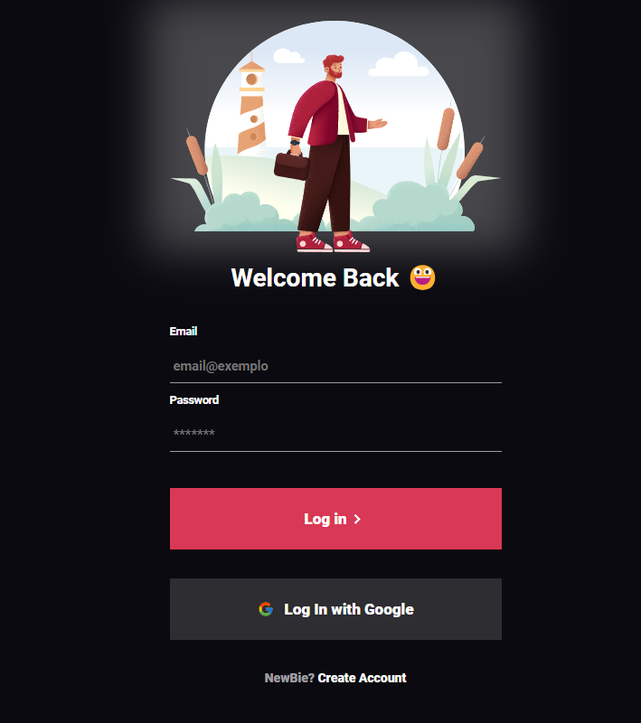

# <h1>Login App </h1>

 Este é um projeto de aplicativo de login simples que demonstra a criação de um formulário de login em HTML e estilização usando CSS.

## <h2> Pré-requisitos</h2>

Não há pré-requisitos específicos para visualizar o projeto, uma vez que é composto apenas de HTML e CSS básicos.

## <h2> Como Usar</h2>

Basta abrir o arquivo `index.html` em um navegador da web para visualizar o aplicativo de login.

## <h2>Estrutura de Arquivos</h2>

- `index.html`: Contém a estrutura HTML do aplicativo de login.
- `style.css`: Arquivo de estilo que define a aparência do aplicativo.

## <h2> Captura de Tela </h2>

  

## Contribuição

Contribuições são bem-vindas! Se você quiser melhorar este aplicativo de login, sinta-se à vontade para criar um fork e enviar suas sugestões.

## Contato

Se precisar de ajuda, pode me contatar pelo email [ricardozanete@gmail.com](mailto:ricardozanete@gmail.com.com) ou abrir uma issue.

## Licença

Este projeto está licenciado sob a Licença MIT - consulte o arquivo [LICENSE](./LICENSE) para obter mais detalhes.
